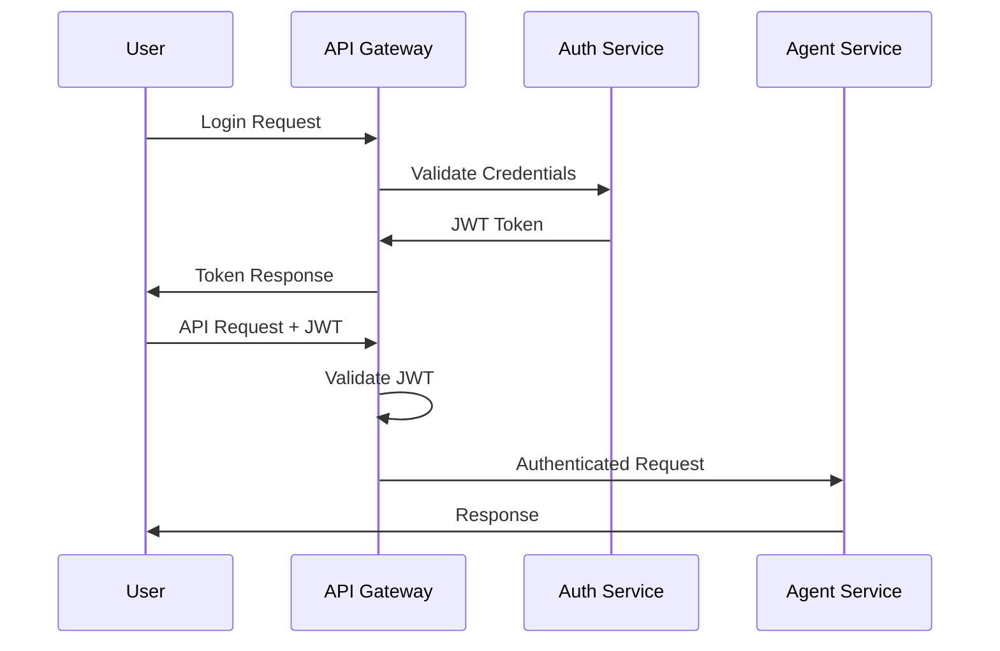

# System Components & Interactions

## Component Overview

The Seven Steps to Poem system is built as a microservices architecture with seven specialized AI agents, supporting infrastructure services, and a unified orchestration layer. Each component is designed for independent deployment, scaling, and monitoring.

## Agent Services Architecture

### 1. Problem Framer Agent

**Service Name**: `problem-framer-service`
**Container**: `seven-steps/problem-framer:latest`
**Port**: 8001

#### Responsibilities
- Parse raw problem text and attachments
- Generate structured problem frames with goals, scope, KPIs
- Conduct interactive clarification sessions
- Validate problem completeness and coherence

#### Technology Stack
```yaml
runtime: Python 3.11 + FastAPI
llm_client + agent: OpenAI GPT-4 + openai-agent
document_processing: PyPDF2, openpyxl, python-docx
vector_search: sentence-transformers for similarity matching
database: PostgreSQL for persistence, Redis for session state
```

#### Key Interactions
- **Input**: Raw text, file uploads via API Gateway
- **Output**: ProblemFrame JSON to Orchestrator
- **Dependencies**: Vector DB for similar problem retrieval
- **Notifications**: Publishes frame completion events to Kafka

#### Configuration
```yaml
environment:
  LLM_PROVIDER: "openai"
  LLM_MODEL: "gpt-4-turbo"
  MAX_CLARIFICATION_ROUNDS: 3
  SESSION_TIMEOUT: 1800  # 30 minutes
  VECTOR_DB_URL: "https://pinecone.example.com"
  
resources:
  cpu: "1000m"
  memory: "2Gi"
  replicas: 3
```

### 2. Issue Tree Agent

**Service Name**: `issue-tree-service`
**Container**: `seven-steps/issue-tree:latest`
**Port**: 8002

#### Responsibilities
- Generate MECE (Mutually Exclusive, Collectively Exhaustive) problem trees
- Create hierarchical decomposition with testable hypotheses
- Produce interactive D3.js visualization data
- Validate tree completeness and logical consistency

#### Technology Stack
```yaml
runtime: Python 3.11 + FastAPI
graph_processing: NetworkX for tree operations
llm_client: OpenAI GPT-4 for decomposition logic
database: Neo4j for tree storage, PostgreSQL for metadata
visualization: D3.js compatible JSON generation
```

#### Key Interactions
- **Input**: ProblemFrame from Problem Framer
- **Output**: Hierarchical IssueTree + visualization data
- **Dependencies**: Neo4j graph database
- **Side Effects**: Creates tree visualization files in MinIO

#### Neo4j Integration
```cypher
// Tree creation pattern
CREATE (root:TreeNode {
    id: $node_id,
    problem_id: $problem_id,
    title: $title,
    level: 0,
    created_at: datetime()
})

// Child relationship
CREATE (parent:TreeNode {id: $parent_id})
CREATE (child:TreeNode {id: $child_id})
CREATE (parent)-[:HAS_CHILD]->(child)
CREATE (child)-[:CHILD_OF]->(parent)
```

### 3. Prioritization Agent

**Service Name**: `prioritization-service`
**Container**: `seven-steps/prioritization:latest`
**Port**: 8003

#### Responsibilities
- Score tree nodes on Impact (1-10) and Feasibility (1-10)
- Calculate composite priority scores with confidence intervals
- Generate ranking rationale and resource estimates
- Support manual priority overrides with audit trail

#### Technology Stack
```yaml
runtime: Python 3.11 + FastAPI
ml_framework: scikit-learn for scoring models
llm_client: OpenAI GPT-4 for rationale generation
database: PostgreSQL for scoring results
caching: Redis for model predictions
```

#### Scoring Algorithm
```python
def calculate_priority_score(impact: int, feasibility: int, 
                           confidence: float, cost_factor: float) -> float:
    base_score = (impact * feasibility) / 100  # Normalize to 0-1
    confidence_adjusted = base_score * confidence
    cost_adjusted = confidence_adjusted * (1 / cost_factor)
    return min(cost_adjusted, 1.0)
```

### 4. Planner Agent

**Service Name**: `planner-service`
**Container**: `seven-steps/planner:latest`
**Port**: 8004

#### Responsibilities
- Generate executable analysis plans for prioritized items
- Define data requirements, methodologies, and resources
- Create realistic timelines with dependencies
- Produce acceptance criteria and success metrics

#### Technology Stack
```yaml
runtime: Python 3.11 + FastAPI
workflow_engine: Temporal.io for plan orchestration
llm_client: OpenAI GPT-4 for plan generation
database: PostgreSQL for plan storage
scheduler: Celery for task scheduling
```

#### Plan Template Structure
```json
{
  "plan_id": "uuid",
  "analysis_type": "cohort_analysis",
  "data_sources": ["user_events", "subscription_data"],
  "methods": ["survival_analysis", "segmentation"],
  "estimated_duration": "4-6 hours",
  "dependencies": ["data_access_approval"],
  "acceptance_criteria": ["p-value < 0.05", "confidence_interval_width < 0.1"],
  "resources": {
    "compute": "8 vCPU, 16GB RAM",
    "software": ["pandas", "lifelines", "matplotlib"]
  }
}
```

### 5. Data Analysis Agent

**Service Name**: `analysis-service`
**Container**: `seven-steps/analysis:latest`
**Port**: 8005

#### Responsibilities
- Execute analysis plans in sandboxed environments
- Generate statistical analyses, visualizations, models
- Produce structured results with artifacts and metadata
- Ensure reproducibility and audit trail

#### Technology Stack
```yaml
runtime: Python 3.11 + JupyterHub
analysis_stack: pandas, numpy, scipy, scikit-learn, matplotlib, seaborn
notebook_engine: Papermill for parameterized execution
database: PostgreSQL + direct data warehouse connections
storage: MinIO for artifacts (charts, CSVs, notebooks)
sandbox: Docker containers with resource limits
```

#### Execution Environment
```dockerfile
FROM jupyter/scipy-notebook:latest

# Install additional packages
RUN pip install papermill lifelines plotly

# Security: limit network access, disable shell access
RUN echo "c.Spawner.disable_user_config = True" >> /etc/jupyter/jupyter_config.py

# Resource limits
ENV MEM_LIMIT=8G
ENV CPU_LIMIT=4
```

#### Analysis Workflow
```python
# Papermill execution pattern
import papermill as pm

result = pm.execute_notebook(
    input_path='templates/cohort_analysis.ipynb',
    output_path=f'results/{plan_id}_analysis.ipynb',
    parameters={
        'data_source': plan.data_source,
        'date_range': plan.date_range,
        'segment_column': plan.segment_column
    },
    kernel_name='python3'
)
```

### 6. Synthesizer Agent

**Service Name**: `synthesizer-service`
**Container**: `seven-steps/synthesizer:latest`
**Port**: 8006

#### Responsibilities
- Aggregate analysis results into coherent evidence chains
- Generate pyramid-structured conclusions (conclusion-first)
- Produce 3 actionable recommendations with confidence scores
- Create implementation roadmaps with risk assessments

#### Technology Stack
```yaml
runtime: Python 3.11 + FastAPI
llm_client: OpenAI GPT-4 for synthesis and reasoning
evidence_chain: LangChain for structured reasoning
database: PostgreSQL for recommendations storage
artifact_storage: MinIO for generated reports
```

#### Synthesis Pipeline
```python
class EvidenceSynthesizer:
    def synthesize_recommendations(self, analysis_results: List[AnalysisResult]) -> List[Recommendation]:
        # 1. Extract key findings
        findings = self.extract_findings(analysis_results)
        
        # 2. Build evidence chains
        evidence_chains = self.build_evidence_chains(findings)
        
        # 3. Generate recommendations
        recommendations = self.generate_recommendations(evidence_chains)
        
        # 4. Assess confidence and risks
        for rec in recommendations:
            rec.confidence = self.calculate_confidence(rec.evidence)
            rec.risks = self.assess_risks(rec.actions)
            
        return sorted(recommendations, key=lambda x: x.confidence, reverse=True)[:3]
```

### 7. Presentation Agent

**Service Name**: `presentation-service`
**Container**: `seven-steps/presentation:latest`
**Port**: 8007

#### Responsibilities
- Generate PowerPoint presentations with corporate templates
- Create video scripts and storyboards
- Produce audio summaries with TTS
- Generate executive summaries (short & long versions)

#### Technology Stack
```yaml
runtime: Python 3.11 + FastAPI
presentation: python-pptx for PowerPoint generation
video: FFmpeg for video compilation
tts: Azure Cognitive Services / AWS Polly
pdf: WeasyPrint for PDF reports
templating: Jinja2 for content templates
```

#### PPT Generation Pipeline
```python
from pptx import Presentation
from pptx.util import Inches

def generate_presentation(recommendations: List[Recommendation], 
                         problem_frame: ProblemFrame) -> str:
    prs = Presentation('templates/corporate_template.pptx')
    
    # Title slide
    title_slide = prs.slides.add_slide(prs.slide_layouts[0])
    title_slide.shapes.title.text = f"Analysis: {problem_frame.goal}"
    
    # Executive summary
    exec_slide = prs.slides.add_slide(prs.slide_layouts[1])
    exec_slide.shapes.title.text = "Executive Summary"
    
    for i, rec in enumerate(recommendations):
        bullet_point = f"{i+1}. {rec.title}\n"
        bullet_point += f"   Impact: {rec.expected_impact}\n"
        bullet_point += f"   Confidence: {rec.confidence:.0%}"
        
    prs.save(f'presentations/{problem_id}.pptx')
    return f'presentations/{problem_id}.pptx'
```

## Supporting Infrastructure Services

### Orchestrator Service

**Service Name**: `orchestrator-service`
**Container**: `seven-steps/orchestrator:latest`
**Port**: 8000

#### Responsibilities
- Coordinate agent workflow execution
- Handle failures and retries with exponential backoff
- Manage state transitions and progress tracking
- Provide human-in-the-loop intervention points

#### Technology Stack
```yaml
runtime: Python 3.11 + FastAPI
workflow_engine: Temporal.io for durable execution
message_queue: Apache Kafka for event streaming
database: PostgreSQL for workflow state
monitoring: Prometheus metrics export
```

#### Workflow Definition
```python
@workflow.defn
class SevenStepsWorkflow:
    @workflow.run
    async def run(self, problem_id: str) -> WorkflowResult:
        # Step 1: Problem Framing
        frame_result = await workflow.execute_activity(
            frame_problem,
            problem_id,
            start_to_close_timeout=timedelta(minutes=10),
            retry_policy=RetryPolicy(maximum_attempts=3)
        )
        
        # Step 2: Issue Tree Generation
        tree_result = await workflow.execute_activity(
            generate_issue_tree,
            frame_result,
            start_to_close_timeout=timedelta(minutes=15)
        )
        
        # Continue with remaining steps...
        return WorkflowResult(success=True, deliverables=deliverables)
```

### API Gateway

**Service Name**: `api-gateway`
**Container**: `kong:latest` or `nginx:alpine`
**Port**: 80, 443

#### Configuration (Kong)
```yaml
services:
  - name: problem-framer
    url: http://problem-framer-service:8001
    routes:
      - name: framer-route
        paths: ["/v1/problems/*/frame"]
        
  - name: orchestrator
    url: http://orchestrator-service:8000
    routes:
      - name: main-route
        paths: ["/v1/problems"]

plugins:
  - name: jwt
    config:
      secret_is_base64: false
      
  - name: rate-limiting
    config:
      minute: 100
      hour: 1000
```

### Message Queue (Kafka)

**Service Name**: `kafka-cluster`
**Container**: `confluentinc/cp-kafka:latest`
**Ports**: 9092, 9093, 9094

#### Topic Configuration
```yaml
topics:
  problem-events:
    partitions: 3
    replication_factor: 2
    retention_ms: 604800000  # 7 days
    
  analysis-tasks:
    partitions: 6
    replication_factor: 2
    retention_ms: 86400000   # 1 day
    
  notifications:
    partitions: 3
    replication_factor: 2
    retention_ms: 259200000  # 3 days
```

### Vector Database (Pinecone)

**Service**: External Pinecone service
**Alternative**: Weaviate self-hosted

#### Index Configuration
```python
import pinecone

pinecone.init(api_key="your-api-key", environment="us-west1-gcp")

# Problem similarity index
index_name = "problem-similarity"
pinecone.create_index(
    name=index_name,
    dimension=1536,  # OpenAI embedding dimension
    metric="cosine",
    replicas=1,
    shards=1
)
```

### Object Storage (MinIO)

**Service Name**: `minio-service`
**Container**: `minio/minio:latest`
**Ports**: 9000, 9001

#### Bucket Structure
```
seven-steps-bucket/
├── problems/{problem_id}/
│   ├── attachments/
│   ├── artifacts/
│   ├── notebooks/
│   └── deliverables/
├── templates/
│   ├── ppt/
│   ├── notebooks/
│   └── reports/
└── exports/
    └── {date}/
```

## Inter-Service Communication Patterns

### Synchronous Communication (HTTP/REST)
```yaml
pattern: Request-Response
use_cases:
  - API Gateway to Agent services
  - Agent to Database queries
  - User interface interactions
  
timeout_strategy:
  connection_timeout: 5s
  read_timeout: 30s
  retry_policy: exponential_backoff(max_attempts=3)
```

### Asynchronous Communication (Message Queue)
```yaml
pattern: Event-Driven Messaging
use_cases:
  - Workflow step completion notifications
  - Progress updates to UI
  - Audit event logging
  
delivery_guarantee: at_least_once
serialization: JSON with schema validation
```

### Workflow Orchestration (Temporal)
```yaml
pattern: Saga Pattern
use_cases:
  - Multi-step analysis workflow
  - Compensation for failed steps
  - Long-running processes with checkpoints
  
durability: persistent workflow state
fault_tolerance: automatic retries with exponential backoff
```

## Security Architecture

### Authentication Flow


### Authorization Matrix
```yaml
roles:
  admin:
    permissions: ["*"]
  analyst:
    permissions: ["problems:read", "problems:create", "analysis:execute"]
  viewer:
    permissions: ["problems:read", "deliverables:download"]
  
resources:
  - problems
  - analysis
  - deliverables
  - audit_logs
  - system_metrics
```

## Monitoring & Observability

### Metrics Collection
```yaml
prometheus_metrics:
  business_metrics:
    - problems_created_total
    - problems_completed_total
    - average_processing_time
    - recommendation_adoption_rate
    
  technical_metrics:
    - http_requests_total
    - http_request_duration_seconds
    - agent_execution_time_seconds
    - database_query_duration
    
  infrastructure_metrics:
    - cpu_usage_percent
    - memory_usage_bytes
    - disk_io_operations
    - network_throughput
```

### Logging Strategy
```yaml
log_levels:
  ERROR: service failures, unrecoverable errors
  WARN: degraded performance, recoverable errors
  INFO: workflow steps, business events
  DEBUG: detailed execution traces (dev only)
  
log_format: structured JSON with trace_id correlation
log_aggregation: ELK Stack (Elasticsearch, Logstash, Kibana)
retention: 30 days for application logs, 1 year for audit logs
```

### Distributed Tracing
```yaml
tracing_system: Jaeger
sampling_rate: 1% in production, 100% in development
trace_context: OpenTelemetry standard
trace_propagation: B3 headers across service boundaries
```

## Deployment Architecture

### Container Orchestration (Kubernetes)
```yaml
# Example deployment for Problem Framer
apiVersion: apps/v1
kind: Deployment
metadata:
  name: problem-framer
spec:
  replicas: 3
  selector:
    matchLabels:
      app: problem-framer
  template:
    spec:
      containers:
      - name: problem-framer
        image: seven-steps/problem-framer:v1.0.0
        ports:
        - containerPort: 8001
        resources:
          requests:
            cpu: 500m
            memory: 1Gi
          limits:
            cpu: 1000m
            memory: 2Gi
        env:
        - name: DATABASE_URL
          valueFrom:
            secretKeyRef:
              name: database-secret
              key: url
        livenessProbe:
          httpGet:
            path: /health
            port: 8001
          initialDelaySeconds: 30
          periodSeconds: 10
```

### Service Mesh (Istio)
```yaml
# Traffic management
apiVersion: networking.istio.io/v1alpha3
kind: VirtualService
metadata:
  name: seven-steps-routing
spec:
  http:
  - match:
    - uri:
        prefix: /v1/problems
    route:
    - destination:
        host: orchestrator-service
    timeout: 300s
    retries:
      attempts: 3
      perTryTimeout: 60s
```

This comprehensive component architecture ensures scalability, reliability, and maintainability while providing clear separation of concerns and well-defined interaction patterns between all system components.