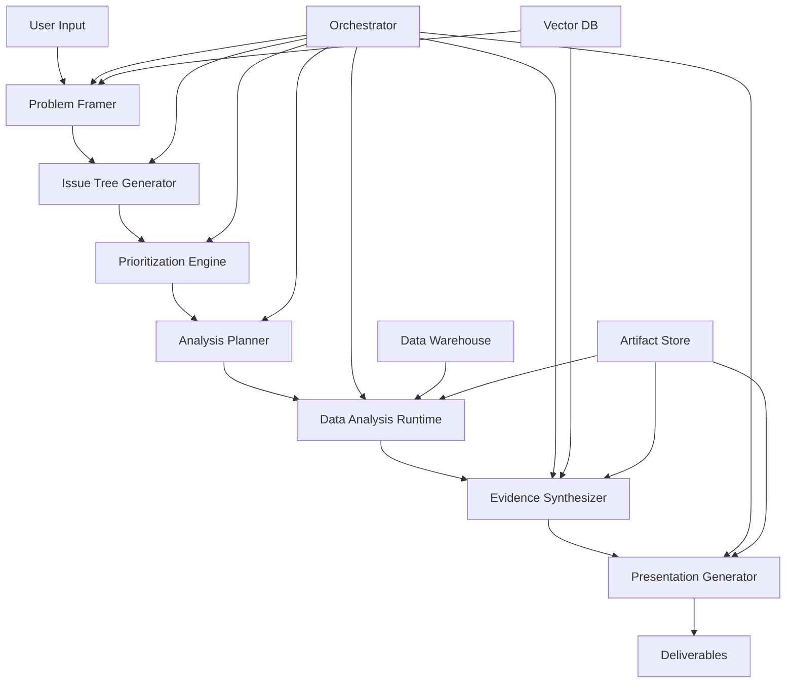

# Seven Steps to Poem - Technical Architecture Documentation

## System Overview

The Seven Steps to Poem AI Agent system is an enterprise-grade business solution platform that automates the McKinsey 7-step problem-solving methodology through a sophisticated multi-agent architecture. The system transforms raw business problems into comprehensive, actionable solutions with full traceability and multi-media deliverables.

## Architecture Principles

- **Microservices**: Each agent operates as an independent service with clear boundaries
- **Event-Driven**: Asynchronous communication between agents via message queues
- **Observability**: Comprehensive logging, monitoring, and audit trails
- **Scalability**: Horizontal scaling for compute-intensive analysis tasks
- **Security**: RBAC, data masking, and compliance-ready audit logs
- **Reliability**: Circuit breakers, retries, and graceful failure handling

## System Components

### Core Agent Services

#### 1. Problem Framer Agent
- **Service**: `problem-framer-service`
- **Responsibility**: Problem clarification and goal definition
- **Input**: Raw text, attachments (PDF, CSV, XLSX)
- **Output**: Structured ProblemFrame JSON
- **Technology**: Python FastAPI + OpenAI/Anthropic LLM
- **Database**: PostgreSQL for metadata, Redis for session state

#### 2. Issue Tree Agent
- **Service**: `issue-tree-service`
- **Responsibility**: MECE problem decomposition
- **Input**: ProblemFrame JSON
- **Output**: Hierarchical IssueTree JSON + D3.js visualization data
- **Technology**: Python + NetworkX for graph operations
- **Storage**: Neo4j for tree relationships

#### 3. Prioritization Agent
- **Service**: `prioritization-service`
- **Responsibility**: Impact × Feasibility scoring
- **Input**: IssueTree nodes
- **Output**: Prioritized analysis queue with scoring rationale
- **Technology**: Python + scikit-learn for scoring models

#### 4. Planner Agent
- **Service**: `planner-service`
- **Responsibility**: Analysis plan generation
- **Input**: Prioritized issues
- **Output**: Executable AnalysisPlan with resource allocation
- **Technology**: Python + Temporal workflow orchestration

#### 5. Data Analysis Agent
- **Service**: `analysis-service`
- **Responsibility**: Statistical analysis execution
- **Runtime**: Sandboxed Jupyter notebooks via JupyterHub
- **Technology**: Python + Pandas/NumPy + R + SQL runners
- **Storage**: MinIO for artifacts, S3-compatible

#### 6. Synthesizer Agent
- **Service**: `synthesizer-service`
- **Responsibility**: Evidence synthesis and recommendation generation
- **Input**: Analysis artifacts and results
- **Output**: Structured recommendations with confidence scores
- **Technology**: Python + LangChain for evidence chaining

#### 7. Presentation Agent
- **Service**: `presentation-service`
- **Responsibility**: Multi-media deliverable generation
- **Output**: PPT, PDF, video scripts, audio files
- **Technology**: Python-pptx, FFmpeg, TTS engines

### Supporting Infrastructure

#### Orchestrator Service
- **Technology**: Temporal.io for workflow orchestration
- **Responsibility**: Agent coordination, failure handling, state management
- **Features**: Retry policies, compensation workflows, human-in-the-loop

#### API Gateway
- **Technology**: Kong or AWS API Gateway
- **Features**: Authentication, rate limiting, request routing
- **Security**: OAuth2/OIDC integration

#### Message Queue
- **Technology**: Apache Kafka or Redis Streams
- **Topics**: `problem-events`, `analysis-tasks`, `notifications`
- **Features**: Dead letter queues, message ordering

#### Vector Database
- **Technology**: Pinecone or Weaviate
- **Use Cases**: RAG for fact checking, similar problem retrieval
- **Features**: Semantic search, embedding management

#### Data Warehouse
- **Technology**: Snowflake or BigQuery
- **Purpose**: Historical analysis data, user data integration
- **Access**: Secure SQL proxy with query optimization

## Data Flow Architecture



## Technology Stack

### Backend Services
- **Language**: Python 3.11+
- **Framework**: FastAPI with async/await
- **ORM**: SQLAlchemy 2.0 with async support
- **Testing**: Pytest with async fixtures

### Frontend Application
- **Framework**: Next.js 14 with App Router
- **Language**: TypeScript
- **UI Library**: React 18 + Tailwind CSS
- **State Management**: Zustand or Redux Toolkit
- **Charts**: D3.js for tree visualization, Plotly.js for analytics

### Data Layer
- **Primary DB**: PostgreSQL 15 with async driver
- **Time Series**: InfluxDB for metrics
- **Cache**: Redis 7.0 with clustering
- **Object Storage**: MinIO or AWS S3
- **Vector Store**: Pinecone or Weaviate

### Infrastructure
- **Containers**: Docker with multi-stage builds
- **Orchestration**: Kubernetes or Docker Compose
- **CI/CD**: GitHub Actions or GitLab CI
- **Monitoring**: Prometheus + Grafana
- **Logging**: ELK Stack (Elasticsearch, Logstash, Kibana)
- **Tracing**: Jaeger for distributed tracing

## Security Architecture

### Authentication & Authorization
- **Identity Provider**: Auth0 or AWS Cognito
- **Tokens**: JWT with short-lived access tokens
- **RBAC**: Fine-grained permissions per agent/resource
- **API Security**: Rate limiting, input validation

### Data Protection
- **Encryption**: TLS 1.3 in transit, AES-256 at rest
- **PII Handling**: Automatic detection and masking
- **Data Classification**: Sensitive, internal, public tiers
- **Compliance**: GDPR, SOC2, ISO 27001 ready

### Audit & Compliance
- **Audit Logs**: Immutable log entries for all actions
- **Data Lineage**: Full traceability of analysis artifacts
- **Retention Policies**: Configurable data lifecycle management
- **Export/Deletion**: GDPR-compliant data subject rights

## Deployment Architecture

### Development Environment
```yaml
services:
  - postgres: Database for development
  - redis: Caching and session storage
  - minio: Object storage
  - jupyter: Notebook development environment
```

### Staging Environment
```yaml
infrastructure:
  - kubernetes_cluster: EKS/GKE/AKS
  - ingress_controller: Nginx or Traefik
  - cert_manager: Automatic TLS certificates
  - monitoring: Prometheus stack
```

### Production Environment
```yaml
high_availability:
  - multi_az_deployment: 3+ availability zones
  - load_balancing: Application load balancer
  - auto_scaling: HPA for compute-intensive agents
  - disaster_recovery: Cross-region backup strategy
```

## Performance Requirements

### Scalability Targets
- **Concurrent Users**: 1,000+ simultaneous sessions
- **Problem Processing**: 100+ problems per hour
- **Analysis Runtime**: 5-10 minutes per complex analysis
- **API Response Time**: <200ms for interactive endpoints

### Resource Allocation
- **Problem Framer**: 2 vCPU, 4GB RAM per instance
- **Analysis Service**: 8 vCPU, 16GB RAM, GPU optional
- **Database**: r5.2xlarge (8 vCPU, 64GB RAM)
- **Cache**: r6g.large (2 vCPU, 16GB RAM)

## Monitoring & Observability

### Key Metrics
- **Business KPIs**: Problem success rate, recommendation adoption
- **Technical KPIs**: Service availability, response times, error rates
- **Agent Performance**: Processing time per step, failure rates
- **Resource Utilization**: CPU, memory, storage, network

### Alerting Strategy
- **Critical**: Service down, data corruption, security breaches
- **Warning**: High latency, resource exhaustion, failed analyses
- **Info**: Deployment completion, scheduled maintenance

## Development Workflow

### Code Organization
```
seven-steps-to-poem/
├── services/
│   ├── problem-framer/
│   ├── issue-tree/
│   ├── prioritization/
│   ├── planner/
│   ├── analysis/
│   ├── synthesizer/
│   └── presentation/
├── shared/
│   ├── models/
│   ├── utils/
│   └── config/
├── frontend/
│   └── web-app/
├── infrastructure/
│   ├── docker/
│   ├── kubernetes/
│   └── terraform/
└── docs/
```

### Development Standards
- **Code Quality**: Black, isort, mypy for Python; Prettier, ESLint for TypeScript
- **Testing**: 90%+ coverage, integration tests, E2E tests
- **Documentation**: OpenAPI specs, architectural decision records
- **Security**: SAST/DAST scans, dependency vulnerability checks

## Risk Mitigation

### Technical Risks
- **LLM Availability**: Multi-provider fallback strategy
- **Data Quality**: Validation pipelines and quality checks
- **Analysis Failures**: Graceful degradation and human escalation
- **Performance**: Caching strategies and resource auto-scaling

### Business Risks
- **Recommendation Accuracy**: Confidence scoring and human review
- **Compliance**: Regular security audits and penetration testing
- **User Adoption**: Comprehensive training and change management

## Next Steps

1. **Infrastructure Setup**: Provision development environment
2. **Core Services**: Implement Problem Framer and Issue Tree agents
3. **Integration Testing**: End-to-end workflow validation
4. **UI Development**: Interactive problem definition interface
5. **Security Hardening**: Implement authentication and audit logging
6. **Performance Testing**: Load testing and optimization
7. **Production Deployment**: Staged rollout with monitoring